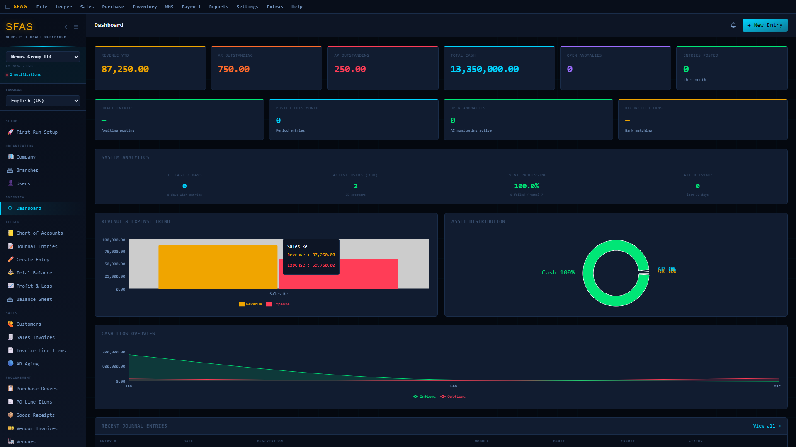
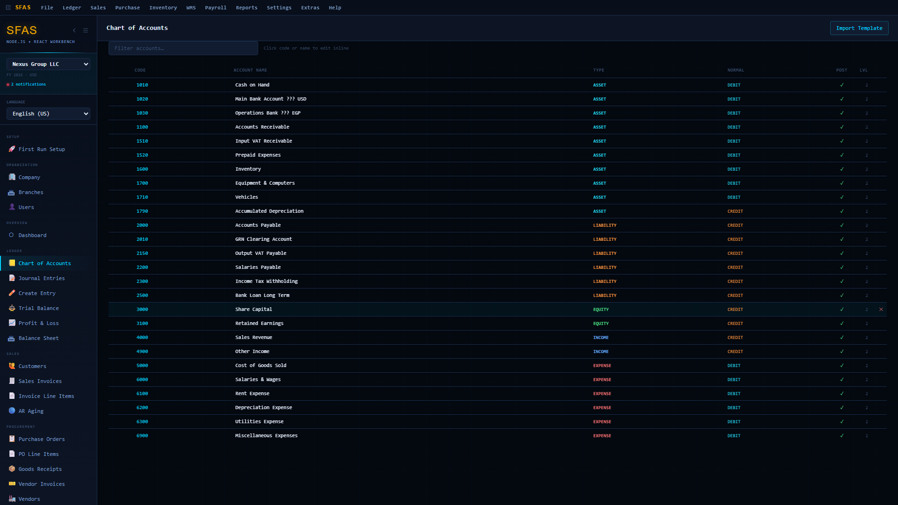
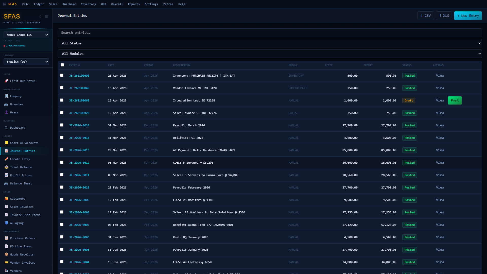
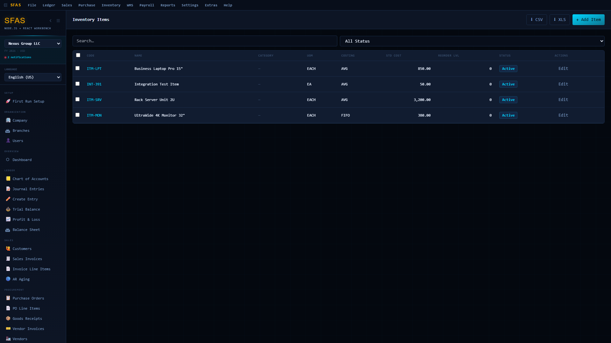
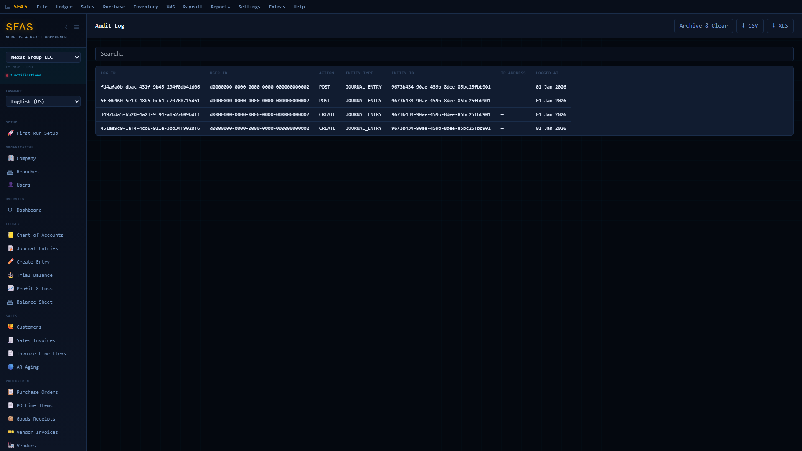

# SFAS WMS — Enterprise Resource Planning Suite

[](https://tops-professor-bass-accompanied.trycloudflare.com)
[](https://github.com/SowinySoft/SFAS_WMS_LIVE_DEMO)
[](https://github.com/SowinySoft/SFAS_WMS_LIVE_DEMO)

**SFAS WMS** is a full-stack Enterprise Resource Planning system covering financial accounting, warehouse management, procurement, sales, payroll, and fixed assets — all backed by an immutable SHA-256 audit chain.

---

## Try It Live

> **[Launch Demo →](https://tops-professor-bass-accompanied.trycloudflare.com)**
>
> **Credentials:** `admin` / `Adm!n@2026`

The demo runs on a live instance with seeded data (26 accounts, 19 journal entries, 4 customers/vendors/POs).

---

## Key Features

| Area | Capabilities |
|------|-------------|
| **General Ledger** | Chart of Accounts (tree view), Journal Entries, multi-currency (15 currencies), period management |
| **Accounts Payable** | Vendor management, PO-based invoicing, payment tracking |
| **Accounts Receivable** | Customer management, sales invoices, aging reports |
| **Inventory / WMS** | Real-time stock tracking, RFID integration, warehouse zone management |
| **Procurement** | Purchase orders, receiving, vendor portal |
| **Payroll** | Employee management, timesheets, pay runs |
| **Fixed Assets** | Asset register, depreciation schedules |
| **Audit Trail** | Immutable SHA-256 hash-chained audit log with integrity verification |
| **i18n** | 8 locales including Arabic RTL, 15 currencies |
| **AI Forecasting** | Built-in forecasting engine with confidence intervals |

---

## Screenshots

| Dashboard | Chart of Accounts |
|-----------|------------------|
|  |  |

| Journal Entries | Inventory Management |
|-----------------|---------------------|
|  |  |

| Audit Trail |
|-------------|
|  |

---

## Architecture

```
React + Vite (frontend)  →  Node.js + Express (API)  →  PostgreSQL 18 (database)
                              │
                              ├── Immutable audit layer (SHA-256 hash chain)
                              ├── 14 schemas (sfas_core, sfas_gl, sfas_sales, …)
                              ├── 120 tables
                              └── 400+ automated tests
```

- **Frontend:** React, Vite, Zustand (state), TanStack Query (data fetching), Axios, Recharts
- **Backend:** Node.js, Express, PostgreSQL 18, JWT auth, rate limiting, audit service
- **Deployment:** Docker, Docker Compose, Helm, Kubernetes
- **Testing:** Playwright (E2E), Jest (unit/integration) — all 400+ tests passing

---

## Demo Walkthrough

Watch the full 60-second product demo:

[](https://github.com/SowinySoft/SFAS_WMS_LIVE_DEMO)

---

## License

Proprietary — All Rights Reserved. This is a private, owned product.

---

*Built with Node.js, React, and PostgreSQL.*
